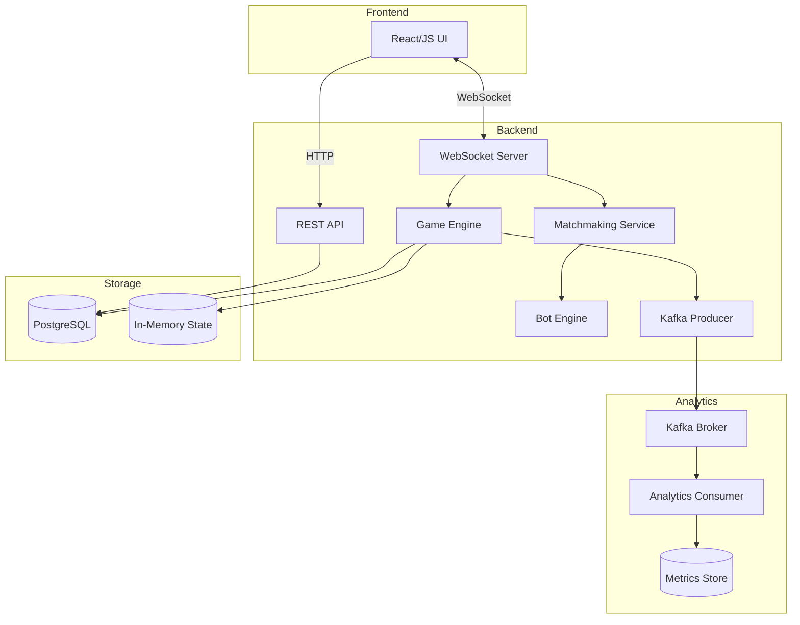
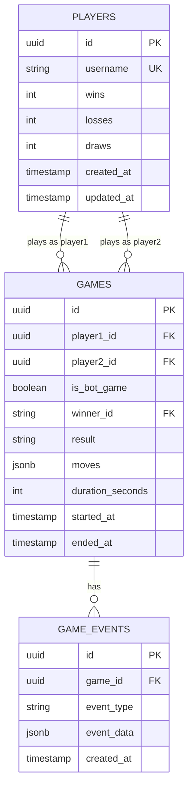
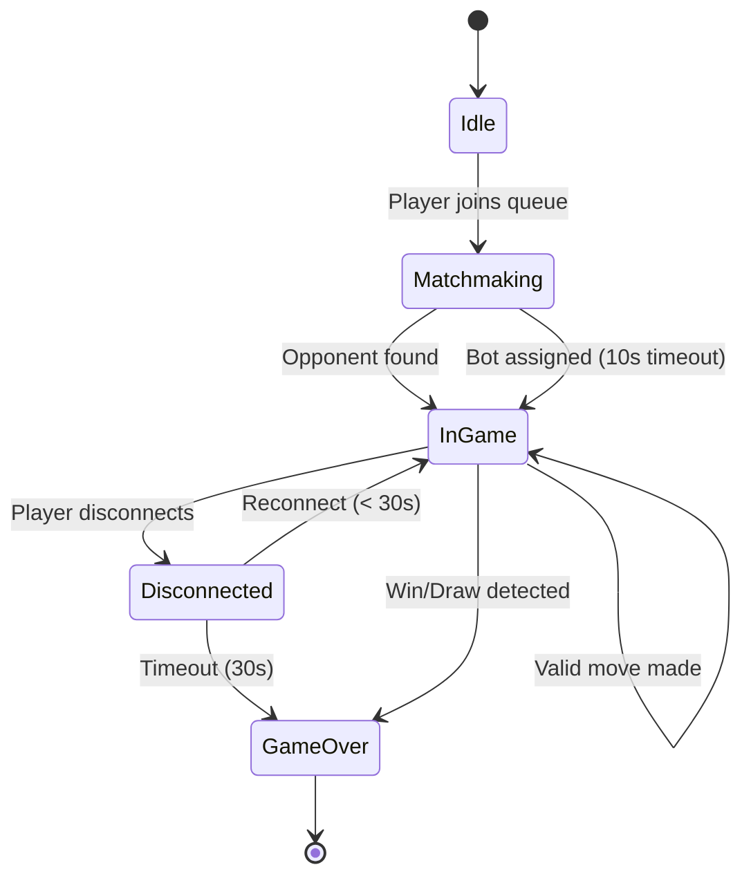
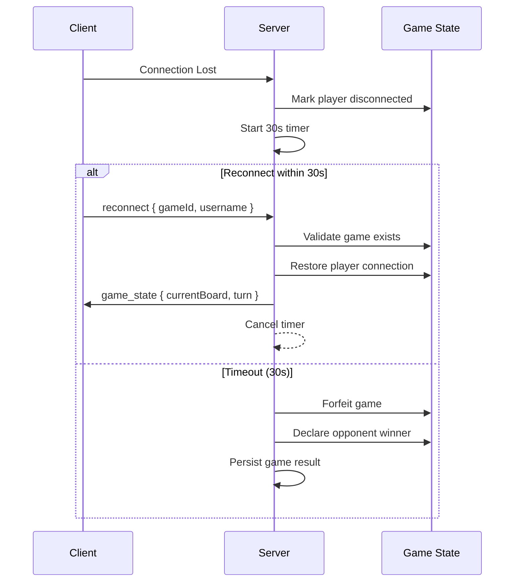

# Software Requirements Specification (SRS)
## 4 in a Row — Real-Time Multiplayer Game

**Version:** 1.0  
**Date:** December 13, 2025  
**Project:** Connect Four Backend Engineering Assignment

---

## Table of Contents
1. [Introduction](#1-introduction)
2. [Overall Description](#2-overall-description)
3. [System Architecture](#3-system-architecture)
4. [Functional Requirements](#4-functional-requirements)
5. [Non-Functional Requirements](#5-non-functional-requirements)
6. [Technical Specifications](#6-technical-specifications)
7. [Database Design](#7-database-design)
8. [API Specifications](#8-api-specifications)
9. [External Interfaces](#9-external-interfaces)
10. [Analytics & Kafka Integration](#10-analytics--kafka-integration)

---

## 1. Introduction

### 1.1 Purpose
This document specifies the software requirements for a real-time, backend-driven implementation of the classic **4 in a Row** (Connect Four) game. The system enables two players to compete against each other or against an intelligent bot, with real-time updates, persistent game history, and analytics tracking.

### 1.2 Scope
The system comprises:
- **Backend Server** — GoLang-based real-time game server
- **Frontend Client** — Web-based UI for game interaction
- **Database Layer** — PostgreSQL for persistent storage
- **Message Queue** — Kafka for analytics event streaming
- **Bot Engine** — Competitive AI opponent

### 1.3 Definitions & Acronyms
| Term | Definition |
|------|------------|
| **WebSocket** | Bidirectional communication protocol for real-time data exchange |
| **Bot** | AI-controlled player that makes strategic moves |
| **Matchmaking** | Process of pairing players for a game session |
| **Disc** | Game piece dropped into the grid |
| **Column** | Vertical slot where discs are dropped |

### 1.4 Technology Stack
| Component | Technology |
|-----------|------------|
| Backend | GoLang (latest stable) |
| Frontend | React.js |
| Database | PostgreSQL |
| Real-Time | WebSockets (Gorilla/nhooyr) |
| Message Queue | Apache Kafka |
| Containerization | Docker & Docker Compose |

---

## 2. Overall Description

### 2.1 Product Perspective
This is a standalone multiplayer game system with the following components:

```
┌─────────────────────────────────────────────────────────────────┐
│                         FRONTEND                                │
│  ┌─────────────┐  ┌─────────────┐  ┌─────────────────────────┐ │
│  │  Game Grid  │  │   Lobby     │  │     Leaderboard         │ │
│  │   (7×6)     │  │   UI        │  │       View              │ │
│  └─────────────┘  └─────────────┘  └─────────────────────────┘ │
└─────────────────────────────────────────────────────────────────┘
                              │ WebSocket / HTTP
                              ▼
┌─────────────────────────────────────────────────────────────────┐
│                       BACKEND (GoLang)                          │
│  ┌─────────────┐  ┌─────────────┐  ┌─────────────────────────┐ │
│  │ Game Engine │  │ Matchmaking │  │    Bot Engine           │ │
│  └─────────────┘  └─────────────┘  └─────────────────────────┘ │
│  ┌─────────────┐  ┌─────────────┐  ┌─────────────────────────┐ │
│  │  WebSocket  │  │  REST API   │  │   Kafka Producer        │ │
│  │   Handler   │  │   Layer     │  │                         │ │
│  └─────────────┘  └─────────────┘  └─────────────────────────┘ │
└─────────────────────────────────────────────────────────────────┘
           │                                    │
           ▼                                    ▼
┌──────────────────────┐            ┌──────────────────────┐
│     PostgreSQL       │            │     Apache Kafka     │
│  - Games History     │            │  - Analytics Events  │
│  - Leaderboard       │            │                      │
└──────────────────────┘            └──────────────────────┘
                                              │
                                              ▼
                                    ┌──────────────────────┐
                                    │  Analytics Consumer  │
                                    │  - Metrics Storage   │
                                    │  - Aggregation       │
                                    └──────────────────────┘
```

### 2.2 User Classes
| User Type | Description |
|-----------|-------------|
| **Player** | Human user who enters username, plays games, and views leaderboard |
| **Bot** | AI opponent automatically assigned when no human opponent is available |

### 2.3 Operating Environment
- **Server:** Linux-based container environment
- **Client:** Modern web browsers (Chrome, Firefox, Safari, Edge)
- **Deployment:** Docker containers with orchestration support

---

## 3. System Architecture

### 3.1 High-Level Architecture



### 3.2 Component Descriptions

#### 3.2.1 Game Engine
- Manages game state (7×6 grid)
- Validates moves and enforces rules
- Detects win/draw conditions
- Handles turn management

#### 3.2.2 Matchmaking Service
- Queues players waiting for opponents
- Implements 10-second timeout for bot pairing
- Manages game session creation

#### 3.2.3 Bot Engine
- Implements strategic AI logic
- Prioritizes blocking opponent wins
- Seeks winning opportunities
- Provides fast response times

#### 3.2.4 WebSocket Handler
- Maintains persistent connections
- Broadcasts game state updates
- Handles reconnection logic

#### 3.2.5 Kafka Producer
- Emits game analytics events
- Publishes player action metrics

---

## 4. Functional Requirements

### 4.1 Player Matchmaking

| ID | Requirement | Priority |
|----|-------------|----------|
| FR-MM-001 | System SHALL allow players to enter a unique username to join matchmaking | **HIGH** |
| FR-MM-002 | System SHALL queue players waiting for opponents | **HIGH** |
| FR-MM-003 | System SHALL pair two queued players within available timeframe | **HIGH** |
| FR-MM-004 | System SHALL initiate bot opponent if no player joins within **10 seconds** | **HIGH** |
| FR-MM-005 | System SHALL prevent duplicate usernames in active sessions | **MEDIUM** |

### 4.2 Game Mechanics

| ID | Requirement | Priority |
|----|-------------|----------|
| FR-GM-001 | System SHALL maintain a **7-column × 6-row** game grid | **HIGH** |
| FR-GM-002 | System SHALL allow players to drop discs into any non-full column | **HIGH** |
| FR-GM-003 | Disc SHALL fall to the lowest available row in the selected column | **HIGH** |
| FR-GM-004 | System SHALL alternate turns between players | **HIGH** |
| FR-GM-005 | System SHALL detect **horizontal** 4-in-a-row win condition | **HIGH** |
| FR-GM-006 | System SHALL detect **vertical** 4-in-a-row win condition | **HIGH** |
| FR-GM-007 | System SHALL detect **diagonal** 4-in-a-row win condition (both directions) | **HIGH** |
| FR-GM-008 | System SHALL declare a **draw** when all 42 cells are filled with no winner | **HIGH** |
| FR-GM-009 | System SHALL validate all moves before applying to game state | **HIGH** |
| FR-GM-010 | System SHALL prevent moves when it's not the player's turn | **HIGH** |

### 4.3 Competitive Bot

| ID | Requirement | Priority |
|----|-------------|----------|
| FR-BOT-001 | Bot SHALL make valid moves according to game rules | **HIGH** |
| FR-BOT-002 | Bot SHALL block opponent's immediate winning move | **HIGH** |
| FR-BOT-003 | Bot SHALL prioritize winning when opportunity exists | **HIGH** |
| FR-BOT-004 | Bot SHALL NOT make random moves | **HIGH** |
| FR-BOT-005 | Bot SHALL respond within **500ms** of player's move | **MEDIUM** |
| FR-BOT-006 | Bot SHALL analyze board state strategically before each move | **HIGH** |

**Bot Decision Priority:**
1. Win if possible (immediate win in next move)
2. Block opponent's immediate win
3. Create winning opportunities (3-in-a-row with open ends)
4. Block opponent's potential winning paths
5. Play strategically (center column preference, etc.)

### 4.4 Real-Time Gameplay

| ID | Requirement | Priority |
|----|-------------|----------|
| FR-RT-001 | System SHALL use WebSocket for real-time bidirectional communication | **HIGH** |
| FR-RT-002 | Both players SHALL receive immediate updates after each move | **HIGH** |
| FR-RT-003 | System SHALL broadcast game state to all connected clients of a session | **HIGH** |
| FR-RT-004 | System SHALL support player disconnection detection | **HIGH** |
| FR-RT-005 | System SHALL allow reconnection using username or game ID within **30 seconds** | **HIGH** |
| FR-RT-006 | System SHALL forfeit game if player doesn't reconnect within **30 seconds** | **HIGH** |
| FR-RT-007 | System SHALL declare opponent (or bot) as winner upon forfeit | **HIGH** |

### 4.5 Game State Management

| ID | Requirement | Priority |
|----|-------------|----------|
| FR-GS-001 | Active games SHALL be maintained in-memory for fast access | **HIGH** |
| FR-GS-002 | Completed games SHALL be persisted to PostgreSQL | **HIGH** |
| FR-GS-003 | Game record SHALL include: players, moves, result, duration | **HIGH** |
| FR-GS-004 | System SHALL clean up in-memory state after game completion | **MEDIUM** |
| FR-GS-005 | System SHALL preserve game state during temporary disconnections | **HIGH** |

### 4.6 Leaderboard

| ID | Requirement | Priority |
|----|-------------|----------|
| FR-LB-001 | System SHALL track number of games won per player | **HIGH** |
| FR-LB-002 | System SHALL provide API endpoint to retrieve leaderboard | **HIGH** |
| FR-LB-003 | Leaderboard SHALL be sorted by win count (descending) | **HIGH** |
| FR-LB-004 | Frontend SHALL display leaderboard to users | **MEDIUM** |
| FR-LB-005 | Leaderboard SHALL update in real-time or near real-time | **LOW** |

### 4.7 Frontend UI

| ID | Requirement | Priority |
|----|-------------|----------|
| FR-UI-001 | UI SHALL display a **7×6 game grid** | **HIGH** |
| FR-UI-002 | UI SHALL allow username input before matchmaking | **HIGH** |
| FR-UI-003 | UI SHALL allow clicking columns to drop discs | **HIGH** |
| FR-UI-004 | UI SHALL visually distinguish between player discs (different colors) | **HIGH** |
| FR-UI-005 | UI SHALL display real-time opponent/bot moves | **HIGH** |
| FR-UI-006 | UI SHALL show game result (win/loss/draw) | **HIGH** |
| FR-UI-007 | UI SHALL display leaderboard | **MEDIUM** |
| FR-UI-008 | UI SHALL indicate whose turn it is | **MEDIUM** |
| FR-UI-009 | UI SHALL show waiting/matchmaking status | **MEDIUM** |

---

## 5. Non-Functional Requirements

### 5.1 Performance

| ID | Requirement | Target |
|----|-------------|--------|
| NFR-P-001 | WebSocket message latency | < 100ms |
| NFR-P-002 | Bot move computation time | < 500ms |
| NFR-P-003 | API response time (leaderboard) | < 200ms |
| NFR-P-004 | Concurrent game sessions supported | ≥ 1000 |
| NFR-P-005 | Database query response time | < 50ms |

### 5.2 Reliability

| ID | Requirement | Target |
|----|-------------|--------|
| NFR-R-001 | System uptime | 99.9% |
| NFR-R-002 | Data persistence guarantee | No game data loss |
| NFR-R-003 | Reconnection success rate | 99% within timeout |
| NFR-R-004 | Graceful degradation on Kafka failure | Analytics queue locally |

### 5.3 Scalability

| ID | Requirement | Description |
|----|-------------|-------------|
| NFR-S-001 | Horizontal scaling | Support multiple backend instances |
| NFR-S-002 | Database connection pooling | Efficient DB resource usage |
| NFR-S-003 | Stateless API design | Enable load balancing |

### 5.4 Security

| ID | Requirement | Description |
|----|-------------|-------------|
| NFR-SEC-001 | Input validation | Sanitize all user inputs |
| NFR-SEC-002 | WebSocket security | Validate session on each message |
| NFR-SEC-003 | Rate limiting | Prevent abuse and DoS attacks |
| NFR-SEC-004 | CORS configuration | Restrict allowed origins |

### 5.5 Maintainability

| ID | Requirement | Description |
|----|-------------|-------------|
| NFR-M-001 | Code documentation | Comprehensive inline comments |
| NFR-M-002 | Modular architecture | Separation of concerns |
| NFR-M-003 | Configuration management | Environment-based config |
| NFR-M-004 | Logging | Structured logging for debugging |

---

## 6. Technical Specifications

### 6.1 Backend (GoLang)

#### Recommended Packages
| Purpose | Package |
|---------|---------|
| HTTP Router | `gorilla/mux` or `chi` |
| WebSocket | `gorilla/websocket` or `nhooyr.io/websocket` |
| Database | `pgx` or `gorm` |
| Kafka | `confluent-kafka-go` or `segmentio/kafka-go` |
| UUID | `google/uuid` |
| Environment | `joho/godotenv` |
| Logging | `zerolog` or `zap` |

#### Project Structure
```
connect-four/
├── cmd/
│   └── server/
│       └── main.go           # Application entry point
├── internal/
│   ├── api/
│   │   ├── handlers/         # HTTP handlers
│   │   ├── middleware/       # Auth, logging, etc.
│   │   └── routes.go         # Route definitions
│   ├── game/
│   │   ├── engine.go         # Game logic
│   │   ├── board.go          # Board operations
│   │   └── types.go          # Game types
│   ├── bot/
│   │   └── strategy.go       # Bot AI logic
│   ├── matchmaking/
│   │   └── queue.go          # Matchmaking logic
│   ├── websocket/
│   │   ├── hub.go            # Connection management
│   │   └── client.go         # Client handling
│   ├── kafka/
│   │   ├── producer.go       # Event publishing
│   │   └── consumer.go       # Analytics consumer
│   ├── repository/
│   │   ├── game.go           # Game persistence
│   │   └── leaderboard.go    # Leaderboard queries
│   └── models/
│       └── models.go         # Domain models
├── pkg/
│   └── config/
│       └── config.go         # Configuration
├── migrations/               # Database migrations
├── frontend/                 # Frontend application
├── docker-compose.yml
├── Dockerfile
├── go.mod
├── go.sum
└── README.md
```

### 6.2 Frontend

#### Structure
```
frontend/
├── public/
│   └── index.html
├── src/
│   ├── components/
│   │   ├── Board.jsx         # Game grid
│   │   ├── Cell.jsx          # Individual cell
│   │   ├── Lobby.jsx         # Matchmaking UI
│   │   ├── Leaderboard.jsx   # Rankings display
│   │   └── GameStatus.jsx    # Turn/result indicator
│   ├── hooks/
│   │   └── useWebSocket.js   # WebSocket hook
│   ├── services/
│   │   └── api.js            # HTTP client
│   ├── App.jsx
│   └── index.jsx
├── package.json
└── vite.config.js
```

---

## 7. Database Design

### 7.1 Entity Relationship Diagram



### 7.2 Table Definitions

#### players
```sql
CREATE TABLE players (
    id UUID PRIMARY KEY DEFAULT gen_random_uuid(),
    username VARCHAR(50) UNIQUE NOT NULL,
    wins INTEGER DEFAULT 0,
    losses INTEGER DEFAULT 0,
    draws INTEGER DEFAULT 0,
    created_at TIMESTAMP WITH TIME ZONE DEFAULT NOW(),
    updated_at TIMESTAMP WITH TIME ZONE DEFAULT NOW()
);

CREATE INDEX idx_players_wins ON players(wins DESC);
```

#### games
```sql
CREATE TABLE games (
    id UUID PRIMARY KEY DEFAULT gen_random_uuid(),
    player1_id UUID REFERENCES players(id),
    player2_id UUID REFERENCES players(id),
    is_bot_game BOOLEAN DEFAULT FALSE,
    winner_id UUID REFERENCES players(id),
    result VARCHAR(10) CHECK (result IN ('player1', 'player2', 'draw', 'forfeit')),
    moves JSONB NOT NULL DEFAULT '[]',
    duration_seconds INTEGER,
    started_at TIMESTAMP WITH TIME ZONE DEFAULT NOW(),
    ended_at TIMESTAMP WITH TIME ZONE
);

CREATE INDEX idx_games_player1 ON games(player1_id);
CREATE INDEX idx_games_player2 ON games(player2_id);
CREATE INDEX idx_games_ended_at ON games(ended_at);
```

#### game_events (for analytics)
```sql
CREATE TABLE game_events (
    id UUID PRIMARY KEY DEFAULT gen_random_uuid(),
    game_id UUID REFERENCES games(id),
    event_type VARCHAR(50) NOT NULL,
    event_data JSONB,
    created_at TIMESTAMP WITH TIME ZONE DEFAULT NOW()
);

CREATE INDEX idx_game_events_game_id ON game_events(game_id);
CREATE INDEX idx_game_events_type ON game_events(event_type);
```

---

## 8. API Specifications

### 8.1 REST Endpoints

#### Player Management

| Method | Endpoint | Description |
|--------|----------|-------------|
| POST | `/api/players` | Register/Get player by username |
| GET | `/api/players/:id` | Get player details |

#### Leaderboard

| Method | Endpoint | Description |
|--------|----------|-------------|
| GET | `/api/leaderboard` | Get top players by wins |
| GET | `/api/leaderboard?limit=N` | Get top N players |

#### Game History

| Method | Endpoint | Description |
|--------|----------|-------------|
| GET | `/api/games/:id` | Get game details |
| GET | `/api/players/:id/games` | Get player's game history |

### 8.2 WebSocket Events

#### Client → Server

| Event | Payload | Description |
|-------|---------|-------------|
| `join_queue` | `{ username: string }` | Enter matchmaking |
| `make_move` | `{ column: number }` | Make a move (0-6) |
| `reconnect` | `{ gameId: string, username: string }` | Rejoin active game |
| `leave_game` | `{}` | Forfeit/leave current game |

#### Server → Client

| Event | Payload | Description |
|-------|---------|-------------|
| `queue_joined` | `{ position: number }` | Confirmation of queue entry |
| `game_started` | `{ gameId, opponent, yourTurn, yourColor }` | Game begins |
| `move_made` | `{ column, row, player, board }` | Move applied |
| `invalid_move` | `{ reason: string }` | Move rejected |
| `game_over` | `{ winner, result, finalBoard }` | Game ended |
| `opponent_disconnected` | `{ timeout: number }` | Opponent left |
| `opponent_reconnected` | `{}` | Opponent returned |
| `game_forfeited` | `{ winner }` | Timeout forfeit |
| `error` | `{ message: string }` | Error occurred |

---

## 9. External Interfaces

### 9.1 WebSocket Protocol

```
Connection URL: ws://host:port/ws?username={username}

Message Format (JSON):
{
    "type": "event_type",
    "payload": { ... },
    "timestamp": "ISO8601"
}
```

### 9.2 Board State Representation

```json
{
    "board": [
        [0, 0, 0, 0, 0, 0, 0],
        [0, 0, 0, 0, 0, 0, 0],
        [0, 0, 0, 0, 0, 0, 0],
        [0, 0, 0, 0, 0, 0, 0],
        [0, 0, 1, 0, 0, 0, 0],
        [0, 2, 1, 2, 0, 0, 0]
    ],
    "currentTurn": 1,
    "moveCount": 4
}
```
- `0` = Empty
- `1` = Player 1 (Red)
- `2` = Player 2 (Yellow)

---

## 10. Analytics & Kafka Integration

### 10.1 Event Types

| Event | Trigger | Data |
|-------|---------|------|
| `game.started` | Game begins | gameId, players, isBot, timestamp |
| `game.move` | Move made | gameId, player, column, moveNumber |
| `game.ended` | Game concludes | gameId, winner, result, duration, totalMoves |
| `player.connected` | User joins | username, timestamp |
| `player.disconnected` | User leaves | username, gameId, timestamp |
| `matchmaking.timeout` | Bot assigned | username, waitDuration |

### 10.2 Kafka Topics

| Topic | Purpose | Retention |
|-------|---------|-----------|
| `game-events` | All game-related events | 7 days |
| `player-events` | Player connection events | 3 days |
| `analytics-aggregated` | Processed metrics | 30 days |

### 10.3 Analytics Metrics

| Metric | Description | Aggregation |
|--------|-------------|-------------|
| Average Game Duration | Mean time per game | Daily/Hourly |
| Games Per Hour | Throughput metric | Hourly |
| Most Frequent Winners | Top winning players | Daily |
| Bot vs Human Ratio | Bot game percentage | Daily |
| Player Retention | Return player rate | Weekly |
| Moves Per Game | Average move count | Daily |

### 10.4 Consumer Implementation

```go
// Analytics Consumer Responsibilities:
// 1. Consume events from Kafka topics
// 2. Aggregate metrics in time windows
// 3. Store aggregated data in PostgreSQL
// 4. Provide API for dashboard queries
```

---

## Appendix A: Game State Machine



---

## Appendix B: Bot Strategy Algorithm

```
FUNCTION botSelectMove(board):
    // Priority 1: Win immediately
    FOR column IN 0..6:
        IF canWin(board, BOT, column):
            RETURN column
    
    // Priority 2: Block opponent's win
    FOR column IN 0..6:
        IF canWin(board, OPPONENT, column):
            RETURN column
    
    // Priority 3: Create 3-in-a-row with open ends
    FOR column IN 0..6:
        IF createsWinningPath(board, BOT, column):
            RETURN column
    
    // Priority 4: Block opponent's 3-in-a-row
    FOR column IN 0..6:
        IF createsWinningPath(board, OPPONENT, column):
            RETURN column
    
    // Priority 5: Center preference
    IF isValidMove(board, 3):
        RETURN 3
    
    // Priority 6: Adjacent to center
    FOR column IN [2, 4, 1, 5, 0, 6]:
        IF isValidMove(board, column):
            RETURN column
```

---

## Appendix C: Reconnection Flow



---

## Revision History

| Version | Date | Author | Description |
|---------|------|--------|-------------|
| 1.0 | 2025-12-13 | — | Initial SRS document |

---

**End of Document**
